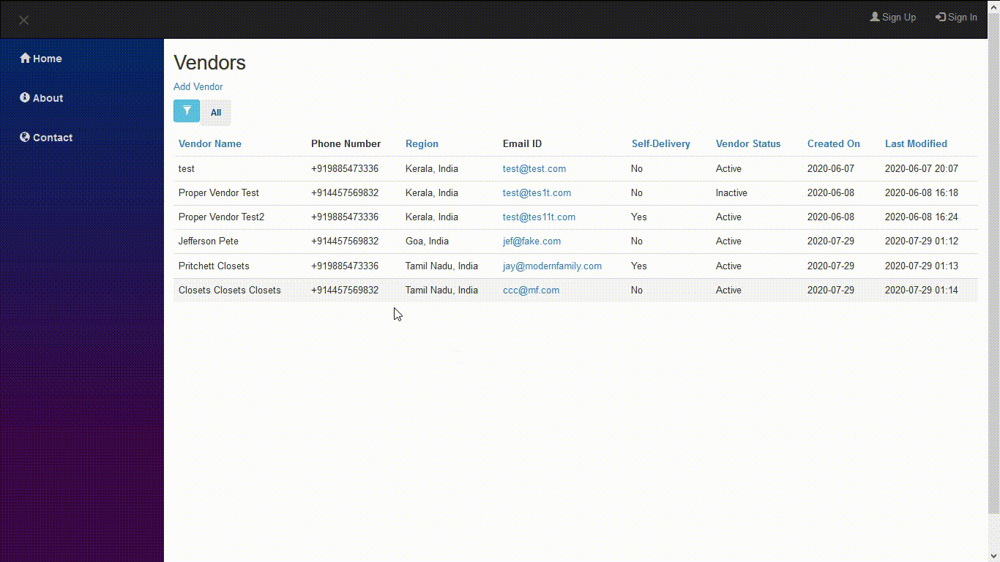

# DYNAMIC-FILTER-LIBRARY
A JavaScript/JQuery library which can power filter and sorting queries for your data easily while you focus on design!



All you have to do is load it up, configure to match the elements to the library and its up and running.  

The library includes the following features:  
1. A _filter_ query generator which allows you to create complex clauses which you can use to dynamically create your SELECT statement.
2. A _sort_ query generator which allows you to select the columns you want to sort while specifying the order of the columns and direction.
3. Filter _breadcrumbs_ which gives more readability and allows you to traverse through your filter clauses.

The library uses JQuery to find the configured elements and perform necessary actions.  
We can add custom methods which needs to be performed to further power it up! The columns and its properties is dynamic! You just need to pass the columns method to fetch the columns names and other details.  
The columns function must be returned in this object format:
```
"colname": {
   text: "Display Text",
   type: "bool|enum|text|numeric|date|datetime|custom",
   validationRegex: "regex expression for validation",
   excludedOperands: ["=", "!", "%%", "!%%", "_%", "!_%", "%_", "!%_", "_", "!_", ">", "<", ">=", "<="] operand to exclude,
   options:
     *bool,*enum,*multiple
       [
           {
               text: "Yes",
               value: "1"
           },
           {
               text: "No",
               value: "0"
           }
       ]
     *numeric
       {
           max_value: Maximum value,
           min_value: Minimmum value,
           def_value: Default Value
       }
     *date
       {
           max_value: Maximum value,
           min_value: Minimmum value,
           def_value: Default Value
       }
     *datetime
       {
           max_value: Maximum value,
           min_value: Minimmum value,
           def_value: Default Value
       }
     *custom
       {
           custom_element: "html text based element with {/id} and {/class} replacement tag"
           options: [{text, value},...],    
           max_value: Maximum value,
           min_value: Minimmum value,
           custom_UI_action: function(){ this.do_something; },
           def_value: Default Value
       }
     *text
       "Default Text Value"

  }
```

Operands supported in this library are:  
- **=** : Equals  
- **!** : Not Equal  
- **%%** : Contains
- **!%%** : Doesn't Contain
- **_%** : Begins with
- **!_%** : Doesn't Begin with
- **%_** : Ends with
- **!%_** : Doesn't End with
- **_** : Empty
- **!_** : Not Empty
- **>** : Greater than
- **<** : Less than
- **>=** : Greater than equal to
- **<=** : Less than equal to

